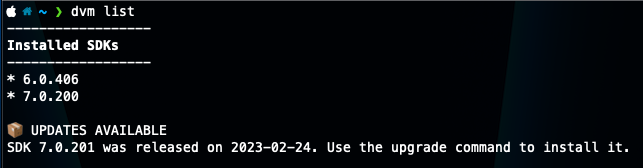

# Dotnet SDK Version Manager

**(WORK IN PROGRESS)**

A multi-platform CLI for managing .NET SDK installations, inspired by [Dots](https://github.com/nor0x/dots)

## Features

- list installed and available SDKs
- easily upgrade to the latest SDK
- install and uninstall specific SDK versions
- get detailed info about a SDK (TBD)
- support for MacOS and Linux (Windows TBD)

## Screenshots!

